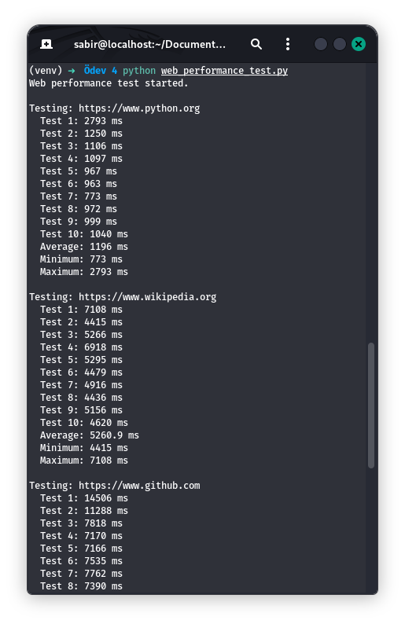
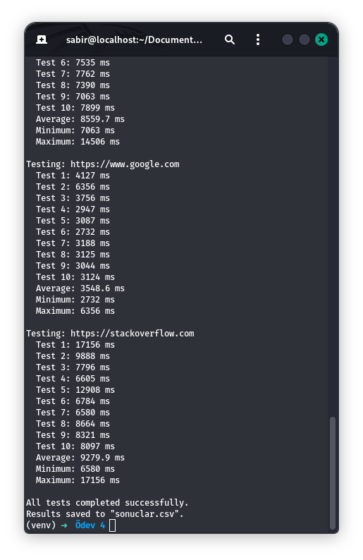

# Web Performance Test with Selenium

This project measures the page load time of five different websites using **Python**, **Selenium**, and browser performance timing data.

## Tested Websites

- Python.org
- Wikipedia.org
- GitHub.com
- Google.com
- Stack Overflow

## Project Purpose

The main goal of this project is to analyze the loading performance of selected websites.  
Each website is tested **10 times**, and the program calculates:

- **Average load time**
- **Minimum load time**
- **Maximum load time**

All raw and summarized results are saved into a CSV file named `sonuclar.csv`.

## Technologies Used

- Python 3
- Selenium
- Chromium
- ChromeDriver
- CSV
- Statistics

## Performance Metric

The program uses browser timing data with the following formula:

```python
load_time = domComplete - navigationStart
```

## Metric Explanation
- navigationStart → the moment the browser starts loading the page
- domComplete → the moment the page and its resources are fully loaded

## Project Files
- web_performance_test.py → main source code
- sonuclar.csv → generated test results
- README.md → project documentation

## How the Program Works
1. Launches the browser with Selenium
2. Opens a target website
3. Reads performance timing data using JavaScript
4. Calculates the page load time
5. Repeats the process 10 times for each website
6. Saves raw and summary results to a CSV file

## Installation
Create and activate a virtual environment:

```
python3 -m venv venv
source venv/bin/activate
```

Install Selenium:
```
pip install selenium
```

Install Chromium and ChromeDriver:
```
sudo apt update
sudo apt install chromium chromium-driver
```
## Run the Program
```
python web_performance_test.py
```

After execution, the program creates the following output file:

```
sonuclar.csv
Example Output
Web performance test started.

Testing: https://www.python.org
  Test 1: 1247 ms
  Test 2: 1189 ms
  Test 3: 1305 ms
  ...
  Average: 1228.4 ms
  Minimum: 1150 ms
  Maximum: 1342 ms
```

## Sample Screenshot
<table align="center">
  <tr>
    <td>
      
    </td>
    <td>
      
    </td>
  </tr>
</table>

## Notes
- Browser and driver versions must be compatible
- Load times may vary depending on internet speed, device performance, and network conditions
- The project is tested on Linux using Chromium and ChromeDriver

## Author
Sabir Suleymanli - suleymanlisabir3@gmail.com
